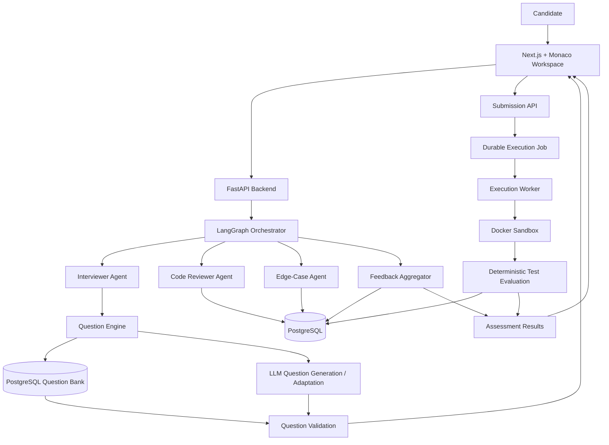

<div align="center">

# MATACSS

### Multi-Agent Technical Assessment & Code Sandboxing System

**An adaptive technical-assessment platform combining LLM reasoning, LangGraph multi-agent orchestration, secure Docker execution, deterministic evaluation, and PostgreSQL-backed assessment state.**

[](https://nextjs.org/)
[](https://fastapi.tiangolo.com/)
[](https://www.python.org/)
[](https://langchain-ai.github.io/langgraph/)
[](https://www.postgresql.org/)
[](https://www.docker.com/)
[](https://microsoft.github.io/monaco-editor/)

</div>

---

## ✦ What is MATACSS?

MATACSS is designed as an **AI-assisted technical interview and coding assessment platform**.

Instead of treating an assessment as a simple sequence of fixed coding questions, MATACSS combines:

| Layer | Responsibility |
|---|---|
| 🧠 **LLM Agents** | Reasoning, question selection/generation, code review, and edge-case reasoning |
| 🔀 **LangGraph** | Multi-agent orchestration, state flow, and validated handoffs |
| 📚 **Question Engine** | Question-bank retrieval plus LLM-assisted generation/adaptation |
| 🛡️ **Docker Sandbox** | Isolated execution of untrusted candidate code |
| ✅ **Deterministic Evaluator** | Official correctness and scoring |
| 🗄️ **PostgreSQL** | Durable assessment and execution state |
| 🖥️ **Next.js + Monaco** | Candidate-facing assessment workspace |
| ⚡ **FastAPI + Workers** | API layer and asynchronous execution lifecycle |

> **Core principle:** LLMs provide reasoning and personalization; Docker provides the execution boundary; deterministic tests remain the authority for correctness.

---

## 🚀 Architecture



### Architecture at a glance

```text
                         ┌──────────────────────┐
                         │      Candidate       │
                         └──────────┬───────────┘
                                    │
                                    ▼
                         ┌──────────────────────┐
                         │  Next.js + Monaco    │
                         └──────────┬───────────┘
                                    │
                                    ▼
                         ┌──────────────────────┐
                         │       FastAPI        │
                         └──────────┬───────────┘
                                    │
                         ┌──────────▼───────────┐
                         │      LangGraph       │
                         │   Multi-Agent Flow   │
                         └──────────┬───────────┘
                                    │
             ┌──────────────────────┼──────────────────────┐
             ▼                      ▼                      ▼
      Interviewer Agent      Code Reviewer Agent    Edge-Case Agent
             │                      │                      │
             └──────────────────────┼──────────────────────┘
                                    ▼
                          ┌────────────────────┐
                          │  Question Engine   │
                          └─────────┬──────────┘
                                    │
                       ┌────────────┴────────────┐
                       ▼                         ▼
                Question Bank              LLM Generation
                       │                         │
                       └────────────┬────────────┘
                                    ▼
                           Question Validation
                                    │
                                    ▼
                             Code Submission
                                    │
                                    ▼
                         Durable Execution Job
                                    │
                                    ▼
                             Execution Worker
                                    │
                                    ▼
                             Docker Sandbox
                                    │
                                    ▼
                         Deterministic Evaluation
                                    │
                         ┌──────────┴───────────┐
                         ▼                      ▼
                  Official Results          AI Feedback
                         │                      │
                         └──────────┬───────────┘
                                    ▼
                           Assessment Report
                                    │
                                    ▼
                              PostgreSQL
```

---

## 🧠 Multi-Agent System

### 1. Interviewer Agent

The Interviewer Agent drives the assessment progression.

**Responsibilities**

- Select the next question based on assessment context.
- Use the question bank for reliable problem retrieval.
- Generate or adapt a new problem when the assessment requires it.
- Adjust topic and difficulty progression.
- Maintain interview context through LangGraph state.

### 2. Code Reviewer Agent

The Code Reviewer Agent analyzes candidate submissions after execution.

**Responsibilities**

- Review algorithmic approach.
- Identify potential correctness risks.
- Analyze time and space complexity.
- Identify implementation and maintainability issues.
- Produce structured technical feedback.

### 3. Edge-Case Agent

The Edge-Case Agent searches for weaknesses that may not be covered by the original visible examples.

**Responsibilities**

- Analyze constraints and candidate code.
- Identify boundary conditions.
- Propose additional edge cases.
- Send candidate cases through the execution/validation boundary.
- Distinguish generated cases from verified cases.

### 4. Feedback Aggregator

Combines agent outputs into a consistent assessment-level feedback model while keeping deterministic correctness separate from AI reasoning.

---

## 📚 Intelligent Question Engine

MATACSS uses a two-source question strategy:

```text
                    Question Engine
                          │
             ┌────────────┴────────────┐
             ▼                         ▼
       Question Bank             LLM Generation
             │                         │
             └────────────┬────────────┘
                          ▼
                 Question Validation
                          │
                          ▼
                  Approved Question
```

A question can contain:

```text
question_id
 title
description
difficulty
topics
constraints
input_format
output_format
examples
expected_language
starter_code
reference_solution
test_cases
metadata
source
```

This lets MATACSS combine **reliable reusable assessment content** with **LLM-driven personalization and generation**.

---

## 🛡️ Secure Code Execution

Candidate source code is **untrusted input** and is never executed directly by the API process.

Each submission is executed inside a short-lived Docker sandbox with defense-in-depth controls:

- 🔒 Network disabled
- 👤 Non-root numeric user
- 📦 Read-only root filesystem
- 🗂️ Restricted temporary filesystem
- 🚫 No host bind mounts or Docker socket
- ⛔ `no-new-privileges`
- 🧩 Linux capabilities dropped
- 💾 Memory, CPU, and PID limits
- ⏱️ Execution timeout
- 📤 Bounded stdout/stderr capture
- 📌 Fixed runtime commands and source paths
- 🔄 Safe stdin transfer
- 🧹 Forced container cleanup

### Supported languages

| Language | Runtime | Execution boundary |
|---|---|---|
| Python | Python runtime image | Docker sandbox |
| C++ | GCC runtime image | Docker sandbox |
| Java | JDK runtime image | Docker sandbox |

> Docker is responsible for **safe execution**, not for deciding whether a solution is correct.

---

## ✅ Deterministic Evaluation

The official evaluator is intentionally independent of LLM reasoning.

```text
Candidate Code
      │
      ▼
Docker Execution
      │
      ▼
stdout / stderr / exit code
      │
      ▼
Official Test Cases
      │
      ▼
Exact Output Comparison
      │
      ▼
Deterministic Score
```

This separation prevents a language model from declaring an incorrect program correct simply because its explanation sounds convincing.

### Evaluation principles

- Official test cases are authoritative.
- Output comparison is deterministic.
- Execution failures are represented explicitly.
- AI feedback does not override official scoring.

---

## 🗃️ PostgreSQL Data Model

PostgreSQL acts as the durable system of record for the assessment platform.

Core data includes:

```text
Candidates
   │
   └── Interview Sessions
          │
          ├── Question Assignments
          │       │
          │       └── Question Bank
          │
          ├── Submissions
          │       │
          │       └── Execution Jobs
          │
          └── Assessment Results

Questions
   └── Test Cases

Evaluations
Agent / assessment metadata
```

Structured relational data is used for authoritative state, while flexible metadata can be represented in PostgreSQL JSONB where appropriate.

---

## 🔄 End-to-End Assessment Flow

1. **Candidate starts an assessment.**
2. **Interviewer Agent** reads the assessment context.
3. **Question Engine** retrieves or generates a suitable problem.
4. **Question Validation** checks the problem and executable test coverage.
5. Candidate receives the problem in the **Monaco workspace**.
6. Candidate submits code and optional standard input.
7. A durable execution job is created in **PostgreSQL**.
8. The **Execution Worker** processes the job.
9. **Docker Sandbox** executes the submission safely.
10. **Deterministic Evaluation** calculates official correctness.
11. **Code Reviewer Agent** analyzes the implementation.
12. **Edge-Case Agent** proposes additional boundary cases.
13. Verified execution data and AI feedback are combined into the assessment report.
14. **Next.js** presents question results and technical feedback.

---

## ⚙️ Technology Stack

| Layer | Technologies |
|---|---|
| Frontend | Next.js, React, TypeScript, Monaco Editor |
| Backend | FastAPI, Python, SQLAlchemy, Pydantic, Alembic |
| Agent Orchestration | LangGraph |
| AI Layer | LLM-powered Interviewer, Reviewer, and Edge-Case agents |
| Database | PostgreSQL |
| Execution | Docker |
| Async Processing | Durable job queue + execution worker |
| Evaluation | Deterministic test-case execution |

---

## 🧱 Repository Structure

```text
MATACSS/
│
├── backend/
│   ├── app/
│   │   ├── api/
│   │   ├── models/
│   │   ├── orchestration/
│   │   ├── schemas/
│   │   └── services/
│   │
│   ├── alembic/
│   ├── scripts/
│   └── tests/
│
├── frontend/
│   ├── app/
│   ├── components/
│   ├── lib/
│   └── types/
│
├── docs/
└── README.md
```

---

## 🧪 Local Development

### Backend

```powershell
cd backend
python -m venv .venv
.\.venv\Scripts\Activate.ps1
python -m pip install -r requirements.txt
python -m alembic upgrade head
python -m uvicorn app.main:app --reload
```

### Frontend

```powershell
cd frontend
npm install
npm run dev
```

### Worker

```powershell
cd backend
python scripts/run_worker.py
```

### Health check

```powershell
Invoke-RestMethod http://127.0.0.1:8000/health
```

---

## 🎯 Project Goal

MATACSS is intended to move technical assessments from a **static question → code → score** workflow toward an **adaptive, reasoning-driven technical interview**.

### The central design idea

```text
LLM Agents
   → reasoning & personalization

LangGraph
   → orchestration & state flow

Question Engine
   → retrieval & generation

Docker
   → secure execution

Deterministic Evaluation
   → trustworthy correctness

PostgreSQL
   → durable assessment state
```

---

## 🌟 Why MATACSS?

MATACSS brings together several systems that are often implemented separately:

**Generative AI** + **Multi-Agent Systems** + **LangGraph** + **Secure Code Sandboxing** + **Deterministic Evaluation** + **Technical Assessment Analytics**

into one end-to-end platform for adaptive programming assessments.

---

<div align="center">

### MATACSS
**Reason. Execute. Verify. Assess.**

</div>
