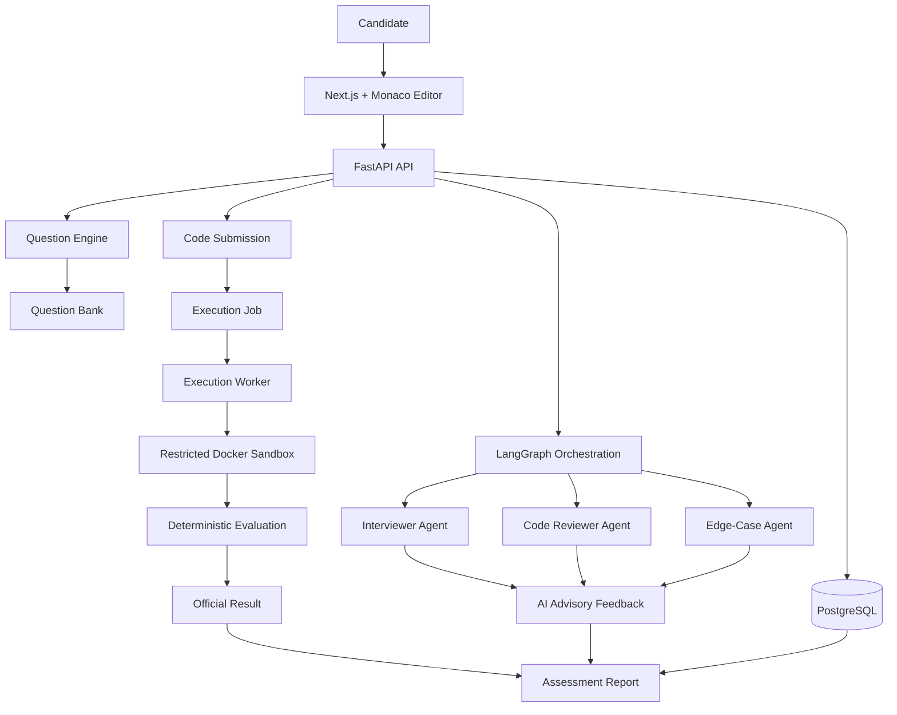

# 🚀 MATACSS

### Multi-Agent Technical Assessment & Code Sandboxing System

**An AI-assisted technical interview platform combining multi-agent reasoning, secure code execution, and deterministic evaluation.**

<br>


[](https://www.python.org/)
[](https://fastapi.tiangolo.com/)
[](https://nextjs.org/)
[](https://www.postgresql.org/)
[](https://www.docker.com/)
[](https://github.com/langchain-ai/langgraph)

<br>

> **Reason. Execute. Verify. Assess.**

---

## 🧭 What is MATACSS?

**MATACSS** is an AI-assisted technical interview and coding-assessment platform designed around a strict separation between **AI reasoning** and **official code correctness**.

The platform brings together:

- 🧠 **LangGraph multi-agent orchestration**
- 📚 **Question Bank & Question Engine**
- 🛡️ **Restricted Docker code execution**
- ✅ **Deterministic executable evaluation**
- 🤖 **AI-powered advisory feedback**
- 🗃️ **PostgreSQL durable state**
- 🔐 **JWT authentication and role-aware authorization**

> **Core Principle:** LLMs make the assessment experience smarter. Deterministic execution decides whether the code actually works.

---

# 🎯 Architectural Philosophy

MATACSS is built around a deliberate separation of responsibilities:

| Problem | MATACSS Approach |
|---|---|
| AI reasoning | Bounded LangGraph multi-agent workflow |
| Code correctness | Deterministic executable tests |
| Untrusted execution | Restricted Docker sandbox |
| Question quality | Lifecycle-controlled Question Bank |
| Question selection | Dedicated Question Engine |
| AI feedback | Separate advisory layer |
| Durable state | PostgreSQL + Alembic |
| Access control | JWT + role-aware authorization |
| Traceability | Persistent submissions, evaluations, provenance and lineage |

The important distinction is simple:

**AI can reason about the assessment. AI is not the grading authority.**

---

# 🏗️ System Architecture


```mermaid
flowchart TD
    Candidate[Candidate] --> Frontend[Next.js + Monaco Editor]
    Frontend --> API[FastAPI API]

    API --> DB[(PostgreSQL)]
    API --> Engine[Question Engine]
    Engine --> Bank[Question Bank]

    API --> Submission[Code Submission]
    Submission --> Job[Execution Job]
    Job --> Worker[Execution Worker]
    Worker --> Sandbox[Restricted Docker Sandbox]
    Sandbox --> Evaluation[Deterministic Evaluation]
    Evaluation --> Result[Official Result]

    API --> Graph[LangGraph Orchestration]
    Graph --> Interviewer[Interviewer Agent]
    Graph --> Reviewer[Code Reviewer Agent]
    Graph --> EdgeCases[Edge-Case Agent]

    Interviewer --> Feedback[AI Advisory Feedback]
    Reviewer --> Feedback
    EdgeCases --> Feedback

    Result --> Report[Assessment Report]
    Feedback --> Report
    DB --> Report
```

## Layer Responsibilities

| Layer | Technology | Responsibility |
|---|---|---|
| **Frontend** | Next.js, React, TypeScript, Monaco | Candidate-facing interview and coding experience |
| **API** | FastAPI, Pydantic | API, authentication, interview lifecycle and persistence |
| **Orchestration** | LangGraph | Multi-agent coordination and validated state flow |
| **Question Engine** | Python, SQLAlchemy | Retrieval, assignment, repeat prevention and lifecycle-aware selection |
| **Question Bank** | PostgreSQL-backed models | Questions, tests, provenance, lineage and lifecycle |
| **Execution Worker** | Python worker | Durable execution-job processing |
| **Sandbox** | Docker | Restricted execution of untrusted candidate code |
| **Evaluator** | Deterministic test runner | Official correctness and scoring |
| **Database** | PostgreSQL, Alembic | Durable assessment state |
| **AI Feedback** | Azure/OpenAI-compatible provider | Advisory analysis separate from official scoring |

---

# 🧠 Multi-Agent Assessment System

MATACSS uses a bounded **LangGraph-based multi-agent workflow**.

### 🎤 Interviewer Agent

Provides a structured recommendation about whether the assessment should **continue or finish** according to the current assessment state.

### 🔍 Code Reviewer Agent

Provides advisory analysis of submitted code using the available assessment context.

### 🧪 Edge-Case Agent

Reasons about:

- Boundary conditions
- Potential hidden-test weaknesses
- Edge cases
- Possible failure scenarios

### 📝 Feedback Aggregator

Combines validated advisory outputs into structured assessment feedback.

### 🔒 Enforcement Rule

The agents are **advisory**.

They do **not** determine official code correctness, and their feedback cannot override deterministic evaluation.

```text
                    Candidate Submission
                           │
             ┌─────────────┴─────────────┐
             ▼                           ▼
     Deterministic Path            LangGraph Path
             │                           │
             ▼                           ├── Interviewer
       Docker Sandbox                   ├── Code Reviewer
             │                           └── Edge-Case Agent
             ▼                           │
     Deterministic Tests                 ▼
             │                    Advisory Feedback
             ▼                           │
      Official Result                    │
             │                           │
             └─────────────┬─────────────┘
                           ▼
                    Assessment Report
```

---

# 📚 Intelligent Question Bank

MATACSS uses a structured Question Bank with lifecycle controls:

```text
draft
  │
  ▼
validated
  │
  ▼
approved
  │
  ▼
active
  │
  ▼
deprecated
```

Questions can contain:

- Problem statement
- Title
- Difficulty
- Expected language
- Input/output specification
- Constraints
- Examples
- Starter code
- Executable test cases
- Reference solution information
- Provenance metadata
- Source information
- LLM lineage
- Lifecycle status

## Question Engine

The Question Engine handles:

- Active-question retrieval
- Question assignment
- Repeat prevention
- Difficulty filtering
- Language filtering
- Lifecycle checks
- Generated/adapted question validation

Generated or adapted questions must pass validation before entering the approved assessment flow.

---

# 📊 LiveCodeBench Integration

MATACSS uses **LiveCodeBench as an external question source** for the Question Bank.

The integration preserves source and provenance information while normalizing imported content into MATACSS question structures.

The dataset is treated as **assessment content**, not as the authority for MATACSS lifecycle state.

```text
LiveCodeBench
      │
      ▼
Import / Normalize
      │
      ▼
MATACSS Question Bank
      │
      ▼
Lifecycle Validation
      │
      ▼
Active Question
      │
      ▼
Question Engine
```

---

# 🛡️ Secure Code Execution

Candidate code is treated as **untrusted input**.

MATACSS executes submissions inside short-lived Docker containers with defense-in-depth controls.

### Sandbox Controls

- 🌐 Network disabled
- 👤 Non-root execution (`65532:65532`)
- 🔒 Read-only root filesystem
- 📁 Bounded writable `/tmp`
- 🚫 `nosuid` / `nodev` protections where implemented
- 🚫 `no-new-privileges`
- 🧱 Dropped Linux capabilities
- 💾 Memory limits
- ⚡ CPU limits
- 🔢 PID limits
- ⏱️ Execution timeout
- 📤 Bounded stdout/stderr
- 📌 Fixed runtime commands and source paths
- 🧹 Container cleanup and teardown
- 🚫 No host Docker socket
- 🚫 No host bind-mount access

These controls form a **defense-in-depth execution boundary**. They are not a claim that every possible Docker or host escape is impossible.

---

# ⚙️ Deterministic Evaluation

MATACSS deliberately separates **execution** from **correctness**.

```text
Candidate Submission
        │
        ▼
Persist Submission
        │
        ▼
Execution Job
        │
        ▼
Execution Worker
        │
        ▼
Docker Sandbox
        │
        ▼
Executable Test Cases
        │
        ▼
Deterministic Evaluation
        │
        ▼
Official Result
```

The deterministic evaluator is the **source of truth for correctness and scoring**.

AI-generated feedback cannot override it.

> **AI explains. Tests decide.**

---

# 🤖 AI Feedback

After deterministic evaluation, the multi-agent system can provide advisory analysis around:

- Code quality
- Reasoning concerns
- Edge cases
- Hidden-test weaknesses
- Interview continuation recommendations
- Assessment observations

The feedback is persisted separately from the official evaluation.

```text
Official Result
       +
AI Advisory Feedback
       │
       ▼
Assessment Report
```

This separation allows MATACSS to benefit from LLM reasoning without making the LLM responsible for correctness.

---

# 🔐 Authentication & Durable State

MATACSS includes JWT-based authentication and role-aware authorization.

### Security & State

- JWT authentication
- Configurable JWT algorithm
- Configurable token expiry
- Role-aware protected endpoints
- Production configuration validation
- Backend-safe CORS configuration
- PostgreSQL durable state
- Alembic schema migrations

PostgreSQL acts as the durable system of record for the assessment lifecycle.

---

# 🔄 End-to-End Assessment Flow

```text
Candidate
   │
   ▼
Interview
   │
   ▼
Question Engine
   │
   ▼
Active Question
   │
   ▼
Monaco Editor
   │
   ▼
Code Submission
   │
   ▼
Execution Job
   │
   ▼
Docker Sandbox
   │
   ▼
Executable Test Cases
   │
   ▼
Deterministic Evaluation
   │
   ├──────────────► Official Result
   │
   ▼
LangGraph Agents
   │
   ▼
AI Feedback
   │
   ▼
Assessment Report
```

### Core Workflow

**Select → Solve → Execute → Verify → Explain → Assess**

---

# 🧰 Technology Stack

| Category | Technologies |
|---|---|
| **Frontend** | Next.js, React, TypeScript, Monaco Editor |
| **Backend** | Python, FastAPI, Pydantic |
| **AI Orchestration** | LangGraph |
| **Database** | PostgreSQL |
| **ORM** | SQLAlchemy |
| **Migrations** | Alembic |
| **Execution** | Docker |
| **LLM Provider Foundation** | Azure OpenAI / OpenAI-compatible configuration |
| **Testing** | Pytest, frontend lint/build checks |
| **CI/CD** | GitHub Actions where present |

---

# 🧪 Verification & Engineering Status

The current implementation has been verified through automated, integration, and real end-to-end execution.

| Verification | Result |
|---|---|
| Backend test suite | **315 passed** |
| PostgreSQL/Docker integration | **29 passed** |
| Frontend lint | ✅ Passed |
| Frontend build + TypeScript | ✅ Passed |
| Python compilation | ✅ Passed |
| Git whitespace check | ✅ Passed |
| Alembic migration heads | **1 current head** |
| Real Docker execution | ✅ Verified |
| Deterministic evaluation | ✅ Verified |
| LangGraph advisory feedback | ✅ Persisted |
| End-to-end assessment flow | ✅ Verified |

### Verified Assessment Path

```text
Submission
    ↓
Execution Job
    ↓
Docker
    ↓
Deterministic Evaluation
    ↓
Official Result
    ↓
LangGraph Advisory Feedback
    ↓
Assessment Completion
```

---

# 🚧 Implementation Status

## ✅ Implemented

- FastAPI backend
- Next.js frontend
- Monaco coding interface
- Candidate management
- Interview lifecycle
- Question Bank
- Question Engine
- Question lifecycle validation
- LiveCodeBench integration
- Persistent submissions
- Durable execution jobs
- Execution worker
- Restricted Docker sandbox
- Deterministic evaluation
- Assessment results
- Assessment feedback
- LangGraph orchestration
- Interviewer Agent
- Code Reviewer Agent
- Edge-Case Agent
- Feedback aggregation
- Azure/OpenAI provider foundation
- JWT authentication
- Role-aware authorization
- PostgreSQL persistence
- Alembic migrations
- Production configuration validation
- Security hardening
- Automated backend/frontend verification

---

# 🗺️ Future Roadmap

The following are **future directions**, not claims about the current implementation.

## Intelligence

- Adaptive interviewing
- Dynamic difficulty rebalancing
- Deeper autonomous question generation
- More advanced multi-stage reasoning workflows

## Scale

- Larger distributed execution infrastructure
- Additional worker orchestration capabilities
- Production-scale operational tooling

## Platform

- Expanded assessment analytics
- More advanced reviewer workflows
- Additional programming-language support
- Further security and infrastructure hardening

---

# 🛠️ Local Development

## Prerequisites

- Docker
- Python 3.12+
- Node.js
- PostgreSQL through the development stack

## 1. Configure Backend

```powershell
Copy-Item backend/.env.example backend/.env
```

Configure:

- PostgreSQL
- JWT settings
- Docker execution settings
- Optional LLM provider settings

**Never commit real credentials or API keys.**

## 2. Start the Development Stack

```powershell
docker compose --env-file backend/.env -f backend/docker-compose.yml up --build -d
```

## 3. Check Services

```powershell
docker compose --env-file backend/.env -f backend/docker-compose.yml ps
```

For schema changes, MATACSS uses Alembic migrations against the configured PostgreSQL database.

---

# 🧱 Repository Structure

```text
MATACSS/
│
├── backend/
│   ├── app/
│   ├── alembic/
│   ├── scripts/
│   ├── tests/
│   ├── .env.example
│   ├── docker-compose.yml
│   └── requirements.txt
│
├── frontend/
│   ├── app/
│   ├── components/
│   ├── lib/
│   └── package.json
│
├── data/
├── docs/
├── .github/
├── README.md
└── .gitignore
```

---

# 🎯 Design Principle

MATACSS is built around a strict architectural boundary:

```text
                    AI
              Reason & Explain
                    │
                    ▼
             LangGraph Agents
                    │
                    ▼
             Assessment Logic
                    │
                    ▼
              Code Execution
                    │
                    ▼
              Docker Sandbox
                    │
                    ▼
          Deterministic Evaluation
                    │
                    ▼
              Official Result
```

### The Philosophy

> **AI makes the assessment smarter.  
> Deterministic execution keeps it trustworthy.**

---

# 🌟 Why MATACSS is Different

MATACSS is not simply an LLM wrapper around a coding editor.

It combines several independent engineering boundaries:

```text
┌─────────────────────────────────────┐
│       Intelligent Assessment       │
│          LangGraph Agents           │
├─────────────────────────────────────┤
│        Question Intelligence        │
│       Question Bank + Engine        │
├─────────────────────────────────────┤
│          Secure Execution           │
│          Docker Sandbox             │
├─────────────────────────────────────┤
│        Objective Evaluation         │
│      Deterministic Test Engine      │
├─────────────────────────────────────┤
│           Durable State             │
│             PostgreSQL              │
└─────────────────────────────────────┘
```

The goal is to combine **AI reasoning with software-engineering discipline** rather than allowing AI to become the grading authority.

---

# 🔮 Project Vision

MATACSS is being developed toward a complete technical assessment platform where:

```text
Question Selection
       ↓
Candidate Interview
       ↓
Secure Code Execution
       ↓
Deterministic Evaluation
       ↓
Multi-Agent Analysis
       ↓
Assessment Report
```

can operate as one reliable, traceable system.

The long-term objective is not simply to add more AI.

It is to build a system where **AI reasoning, secure execution, deterministic evaluation, and durable engineering architecture work together.**

---

# MATACSS

### Reason. Execute. Verify. Assess.

**AI-assisted assessment with deterministic correctness.**
