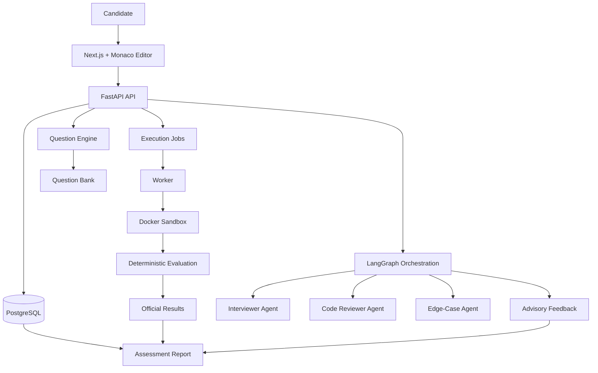

# MATACSS

<div align="center">


[](https://www.python.org/)
[](https://fastapi.tiangolo.com/)
[](https://nextjs.org/)
[](https://www.postgresql.org/)
[](https://www.docker.com/)
[](https://github.com/langchain-ai/langgraph)

</div>

## Multi-Agent Technical Assessment & Code Sandboxing System

MATACSS is an AI-assisted technical interview and coding-assessment platform that combines a LangGraph multi-agent workflow, a Question Bank and Question Engine, a secure Docker-based execution boundary, and deterministic evaluation as the source of truth for correctness.

> Core principle: LLM reasoning informs the assessment experience; deterministic execution decides the official result.

## Why MATACSS

The platform is designed for structured technical assessment workflows where the interview experience, question quality, and grading logic must all remain traceable and auditable.

- Interviewer, code-review, and edge-case reasoning are handled by bounded agents.
- Question selection and assignment are managed by a dedicated Question Engine.
- Candidate code is executed in a restricted Docker sandbox.
- Official correctness is calculated by executable tests, not by model judgment.
- PostgreSQL stores durable assessment and application state.

## System overview


```mermaid
flowchart TD
    Candidate --> Frontend[Next.js + Monaco Editor]
    Frontend --> API[FastAPI API]
    API --> DB[(PostgreSQL)]
    API --> Engine[Question Engine]
    Engine --> Bank[Question Bank]
    API --> Jobs[Execution Jobs]
    Jobs --> Worker[Worker]
    Worker --> Sandbox[Docker Sandbox]
    Sandbox --> Eval[Deterministic Evaluation]
    Eval --> Results[Official Results]
    API --> Graph[LangGraph Orchestration]
    Graph --> Interviewer[Interviewer Agent]
    Graph --> Reviewer[Code Reviewer Agent]
    Graph --> Edge[Edge-Case Agent]
    Graph --> Feedback[Advisory Feedback]
    Feedback --> Report[Assessment Report]
    Results --> Report
    DB --> Report
```

## Implemented today

### 1. Multi-agent assessment orchestration

MATACSS includes a LangGraph-based orchestration layer for interview assessment flows:

- Interviewer Agent: provides a structured recommendation to continue or finish the assessment.
- Code Reviewer Agent: produces advisory findings using safe execution context and source material.
- Edge-Case Agent: reasons about boundary conditions and hidden test concerns without overriding official evaluation.
- Feedback Aggregator: combines validated advisory outputs into a structured assessment report.

The LLM layer is advisory. The Question Engine resolves the next active question and deterministic execution remains the authoritative correctness layer.

### 2. Question Bank and Question Engine

The repository contains a working Question Bank and Question Engine for technical assessment workflows.

Key capabilities implemented:

- Question lifecycle states including `draft`, `validated`, `approved`, `active`, and `deprecated`
- Question metadata such as title, description, difficulty, expected language, constraints, and starter code
- Executable test cases, including sample/private classification and ordering metadata
- Provenance and lineage records, including platform-origin and source metadata
- Validation before generated or adapted questions are approved
- Active-question filtering, assignment, and repeat prevention
- Difficulty and language-based filtering where the platform checks are in place

LiveCodeBench is present as an imported question source and is used to seed or normalize Question Bank entries. Its role is to provide a structured external dataset source with provenance; the raw dataset itself is not stored in the repository and no unsupported dataset totals are claimed here.

### 3. Secure code execution

Candidate code is executed inside short-lived Docker containers with explicit execution controls, including:

- disabled networking
- non-root execution (`65532:65532`)
- read-only root filesystem
- bounded writable `/tmp`
- `nosuid` / `nodev` protections where implemented
- `no-new-privileges`
- dropped Linux capabilities
- CPU, memory, PID, and timeout limits
- bounded stdout/stderr output
- fixed runtime commands and source paths
- cleanup and container teardown
- no host Docker socket and no host bind mount access

This is a defense-in-depth sandbox boundary, not a claim that every possible Docker/host escape is impossible.

### 4. Deterministic evaluation

The platform follows an explicit grading flow:

1. Candidate code is submitted through the interview flow.
2. The submission is persisted and queued as an execution job.
3. The worker executes the code inside Docker.
4. Test cases run against the submission.
5. Deterministic evaluation calculates the official result.
6. LLM-generated feedback is persisted separately as advisory guidance.
7. The assessment report combines official correctness with AI commentary.

The deterministic result is authoritative. LLM feedback must never override it.

### 5. Authentication, authorization, and durable state

MATACSS includes JWT-based authentication and role-aware access control for protected endpoints. The backend stores durable application and assessment state in PostgreSQL and uses Alembic migrations for schema evolution.

Current configuration supports:

- JWT secret, algorithm, and expiry configuration
- role-based checks for protected interview and assessment routes
- backend-safe CORS configuration and production validation
- PostgreSQL as the durable system of record

### 6. Provider foundation for LLM access

The backend includes a provider abstraction for LLM access, with support for Azure OpenAI and OpenAI-style configuration. Supported inputs include:

- Azure endpoint and API key configuration
- deployment/model configuration
- backend-only provider setup and validation
- structured/native JSON handling where implemented
- safe provider error handling

No real secrets or credentials are included in the repository; configuration is expected from environment variables.

## Assessment flow

```text
candidate -> interview -> question -> submission -> execution job -> Docker -> deterministic evaluation -> AI feedback -> assessment report
```

This is the core operational flow the project currently implements.

## Technology stack

| Area | Technologies |
| --- | --- |
| Frontend | Next.js, React, TypeScript, Monaco Editor |
| Backend | FastAPI, Python, Pydantic |
| AI Orchestration | LangGraph |
| Data & Persistence | PostgreSQL, SQLAlchemy, Alembic |
| Execution | Docker, restricted sandbox runtime |
| Model Access | Azure OpenAI / OpenAI provider foundation |
| CI & Delivery | GitHub Actions where present in repo |

## Local development

### 1. Backend setup

Copy the environment template and configure the local deployment values:

```powershell
Copy-Item backend/.env.example backend/.env
```

The backend expects PostgreSQL, JWT settings, Docker execution configuration, and optional LLM credentials via environment variables. The example file shows the current runtime contract.

### 2. Start the stack

```powershell
docker compose --env-file backend/.env -f backend/docker-compose.yml up --build -d
```

This compose stack starts PostgreSQL, the Alembic migration step, the FastAPI API, the execution worker, and the Next.js frontend.

### 3. Validate and inspect

```powershell
docker compose --env-file backend/.env -f backend/docker-compose.yml ps
```

For manual migration work, the repository relies on Alembic-based schema upgrades and the backend's configured PostgreSQL database.

## Repository structure

```text
MATACSS/
├── backend/
│   ├── app/
│   ├── alembic/
│   ├── scripts/
│   ├── tests/
│   ├── .env.example
│   ├── docker-compose.yml
│   └── requirements.txt
├── frontend/
│   ├── app/
│   ├── components/
│   ├── lib/
│   └── package.json
├── docs/
├── data/
├── README.md
├── .gitignore
└── .github/
```

## Future work and roadmap

The following items are not presented as implemented in the current codebase:

- adaptive interviewing and dynamic question difficulty rebalancing
- deeper autonomous question generation beyond the current foundations
- advanced multi-stage LLM reasoning workflows beyond the present bounded agent design
- additional distributed execution infrastructure such as Redis, RabbitMQ, Celery, or ARQ job queues
- guaranteed host-level escape prevention claims for any Docker deployment

These items may be future product directions, but the current implementation remains conservative and grounded in the repository as it exists today.

## Closing

MATACSS is built around a clear architectural boundary: AI guides the assessment experience, while Docker execution and deterministic tests decide correctness. That balance makes the system suitable for technical interviews, code-assessment workflows, and structured reviewer tooling without allowing model output to silently override objective test results.

If you are evaluating the project as a software engineering effort, the strongest signals are the combination of LangGraph orchestration, secure sandbox execution, Question Bank lifecycle controls, PostgreSQL durability, and a strict deterministic grading model.